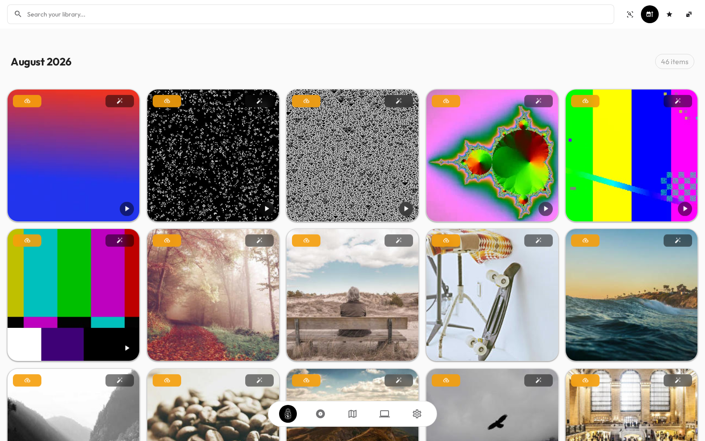
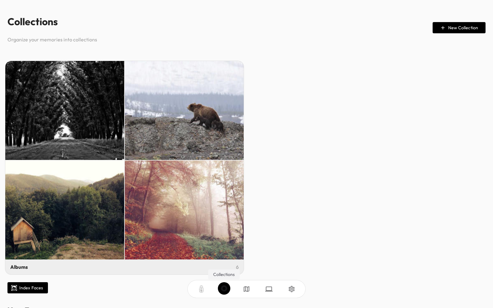
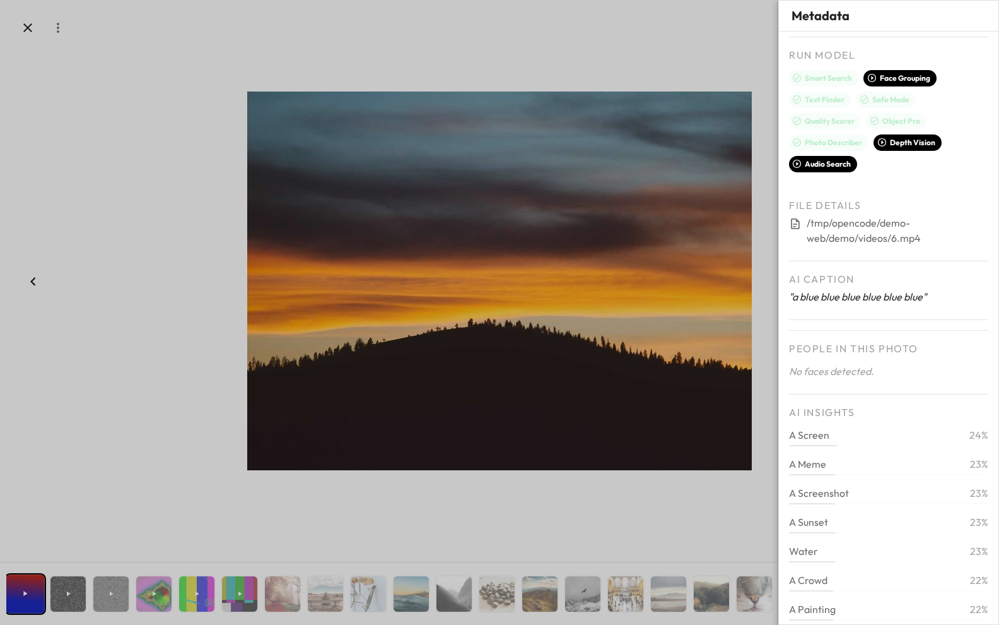

# Siegu

> **Your photo library, finally all in one place — and it stays on your device.**



Siegu (say it *see-goo*) is a **private, local-first photo and video manager**
that runs entirely on your own computer. You point it at your pictures, and it
organizes them, lets you search them in plain words, finds the people in them,
and keeps them in sync across your own devices — all **without ever uploading
anything to the cloud**.

No accounts. No cloud. No ads. Your photos never leave your machine.

---

## What does it do for me?

Siegu is built to feel obvious. Here's what you can do with it:

- **Find any photo by describing it** — type *"sunset at the beach"* or *"my
  dog on the couch"* and it finds the matching pictures, without you having to
  tag them all by hand.
- **See where things were taken** — the app reads the location stored in your
  photos and labels them with real city names.
- **Know who's in your photos** — it detects faces and groups them, so you can
  jump straight to every photo of a person.
- **Read the text in your photos** — it recognizes writing in images and
  documents, so you can search for that photo of a receipt or a whiteboard.
- **See your best shots** — it scores every photo for quality and shows the
  highlights of each day at a glance.
- **Keep devices in sync on your own network** — link your phone, tablet, and
  computer so your library matches everywhere, encrypted.

All of this is powered by **AI models that run directly on your device** —
nothing is sent to a server to be processed.

---

## What does it look like?

Here's the app in action.

| Your library, organized and searchable | Collections and albums |
|---|---|
|  |  |

When you open any photo, you can see everything the app knows about it — its
AI-written caption, the objects it found, any text it recognized, and how it
scored on quality:



---

## Where does it run?

Siegu works on the devices you already own:

- **Windows** (PCs and laptops)
- **macOS** (Apple Silicon Macs)
- **Linux** (desktop and laptop computers)
- **Android** (phones and tablets)
- **iOS / iPadOS** (iPhone and iPad)

And it looks for the same photos in the same ways wherever you open it.

---

## How do I install it?

The simplest way is from source (see the full guide in
[Getting Started](docs/getting-started.md)):

```bash
git clone https://github.com/denzyldick/siegu.git
cd siegu
bun install
bun run tauri dev
```

> Prefer npm? It works too: `npm install && npm run tauri dev`.
>
> **You'll need**: [Node.js](https://nodejs.org) 20.19+, [Bun](https://bun.sh)
> (or npm), and [Rust](https://rustup.rs/). Platform-specific dependencies are
> listed in [Getting Started](docs/getting-started.md).

When it opens, a friendly setup wizard walks you through adding your photo
folders and downloading the AI models.

---

## First run, in five steps

1. **Add your folders** — point Siegu at your photo and video library.
2. **Download a couple of AI models** — the magic happens on your device.
3. **Let it scan** — it finds and organizes your media.
4. **Let it analyze** — it adds captions, faces, locations, and text.
5. **Enjoy** — search, browse, and (optionally) sync your other devices.

---

## Documentation

The docs live in the `docs/` folder and cover everything from the first steps to
deep technical detail:

| For you | Docs |
|---------|------|
| **Contributors** | [CONTRIBUTING.md](CONTRIBUTING.md), [Developing](docs/developing.md), [End-to-End testing](docs/e2e.md) |
| **New users** | [Getting Started](docs/getting-started.md), [Configuration](docs/configuration.md), [Sharing with friends](docs/sharing.md), [Web client](docs/webclient.md) |
| **Builders / developers** | [Build](docs/build.md), [Architecture](docs/architecture.md), [ML engine](docs/ml-engine.md), [Frontend](docs/frontend.md), [Backend](docs/backend.md), [Database](docs/database.md) |
| **Advanced** | [CLI](docs/cli.md), [Sync](docs/sync.md), [Mesh networking](docs/mesh-protocol.md), [Security](docs/security.md), [Android](docs/android.md), [iOS](docs/ios.md) |

---

## Privacy & license

Siegu is **privacy-first by design**: everything runs locally, there are no
accounts, no telemetry, and no cloud uploads. The AI models are downloaded once
from public sources and then run forever on your device.

Licensed under **FSL-1.1-Apache-2.0** — free to use, commercially usable for
non-competing products, and automatically becoming **Apache 2.0** on
March 9, 2028. See [LICENSE](LICENSE).
